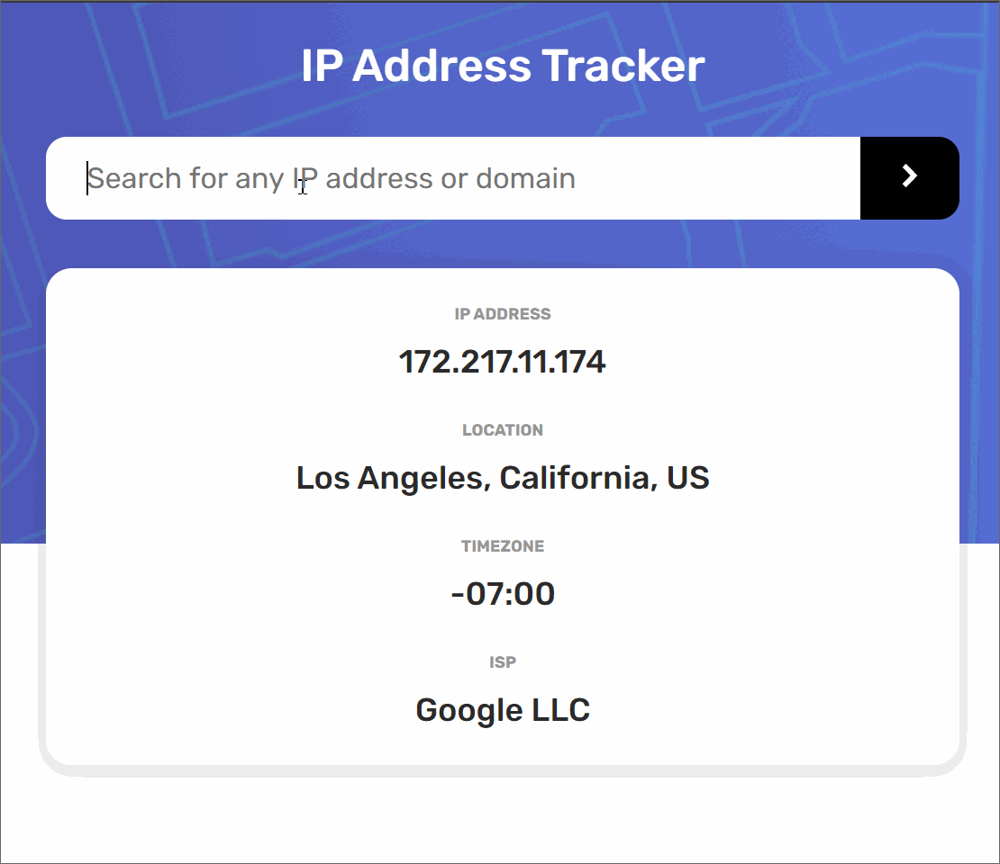

# Frontend Mentor - IP Address Tracker

This is a coding project challenge from the site Frontend Mentor that I completed using vanilla HTML/CSS/JS, alongside async/await JS functions.

It uses a geolocation API from Ipify to gather the 'tracker' data, and also supports domain name inputs.

-------

View live at: https://foolmonkey.github.io/ip_address_tracker/

